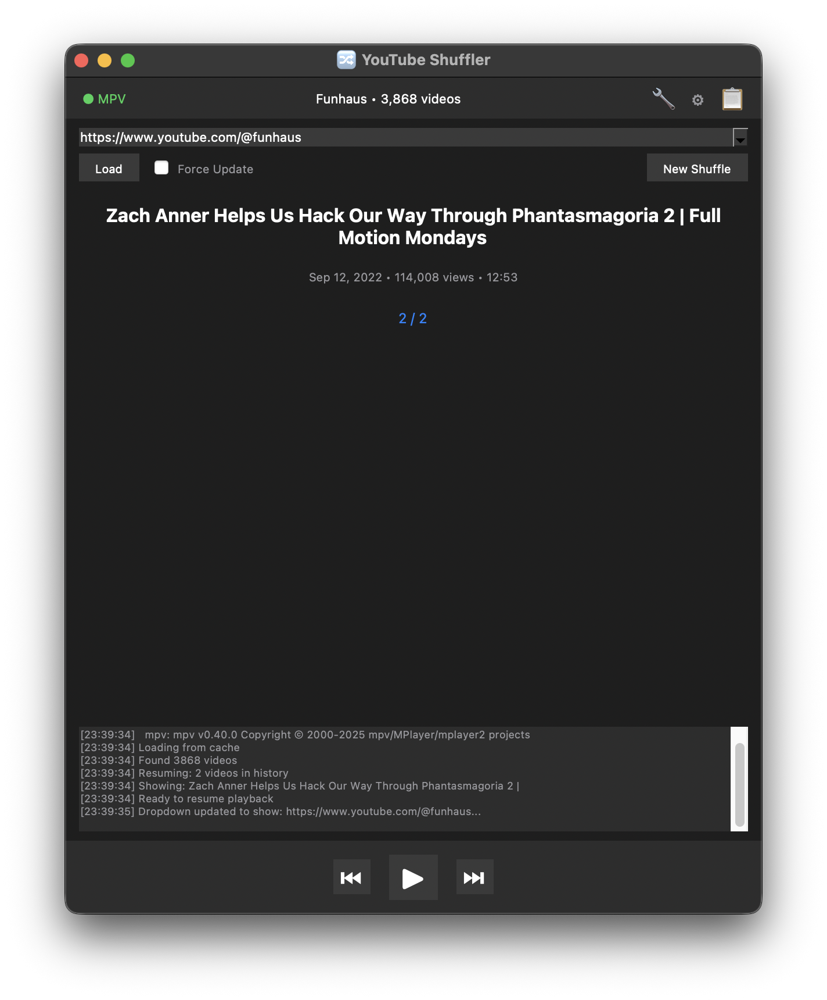
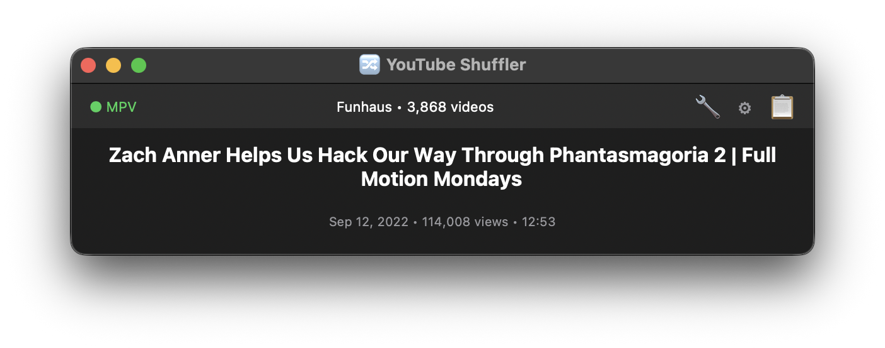
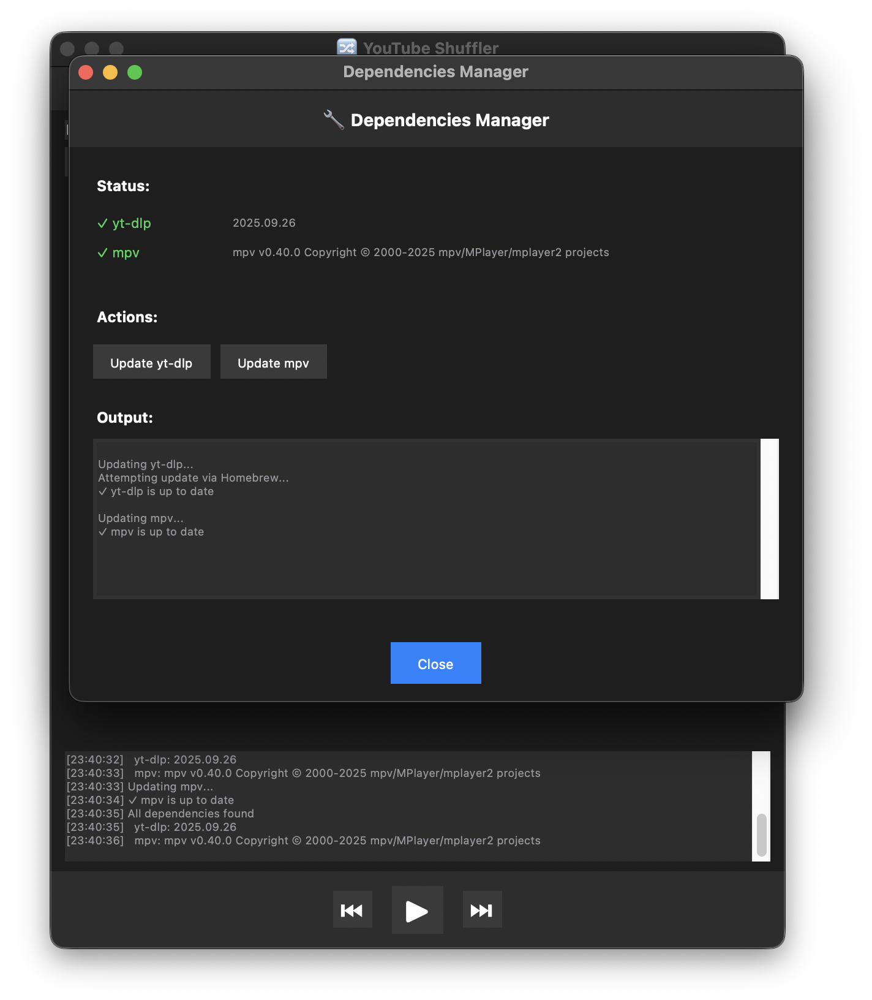

# 🔀 YouTube Shuffler

A dark-themed Python GUI application for shuffling and playing videos from any YouTube channel in random order using yt-dlp and mpv. No ads and mpv can use sponsorblock!



## Features

- 🎲 **Random Shuffle** - Play any YouTube channel's videos in random order
- 📚 **History Navigation** - Go back and forward through watched videos
- 💾 **Smart Caching** - Fast channel loading with automatic metadata updates
- 🔄 **State Persistence** - Resume exactly where you left off, per channel
- 🎬 **Rich Metadata** - Display title, views, duration, and upload date
- ⌨️ **Keyboard Shortcuts** - Arrow keys (←/→) and Space for quick navigation
- 🌙 **Dark Theme** - macOS-inspired minimal interface

## Collapsible

- Click the gear icon to show/hide the channel switcher
- Click the clipboard to show/hide the logs
- Resize to shrink it out of the way



## Built-in Dependency Manager

- Click the 🔧 icon to check dependency status and update yt-dlp/mpv directly from the GUI.




## Dependencies

- **Python 3.8+**
- **[yt-dlp](https://github.com/yt-dlp/yt-dlp)** - YouTube video metadata
- **[mpv](https://github.com/mpv-player/mpv)** - Video playback

### Installation

**macOS (Homebrew):**
```bash
brew install python3 yt-dlp mpv
```

**Linux (Debian/Ubuntu):**
```bash
sudo apt install python3 python3-tk yt-dlp mpv
```

**Windows (winget):**
```bash
winget install Python.Python.3 yt-dlp mpv
```

## Running

```bash
python3 shuffle.py
```

Or with UV:
```bash
uv run shuffle.py
```

## Usage

1. **Enter a YouTube channel URL** (e.g., `https://youtube.com/@channelname`)
2. **Click "Load"** to fetch the channel's videos
3. **Click "Next ⏭"** to play a random video
4. Use **Previous ⏮** to go back in your watch history
5. **New Shuffle** clears history for a fresh start

### Keyboard Shortcuts

- `←` Previous video
- `→` Next video
- `Space` Replay current video

### Managing Multiple Channels

- Dropdown shows previously loaded channels
- Each channel maintains its own watch history
- Switch between channels anytime - your position is saved

### Data Storage

```
./cache/    # Channel video metadata
./config/   # Shuffle history and states  
./logs/     # Activity logs (5MB rotation)
```

## License

Unlicense

## AI Disclosure
Made with claude-sonnet-4-5-20250929-thinking-32k